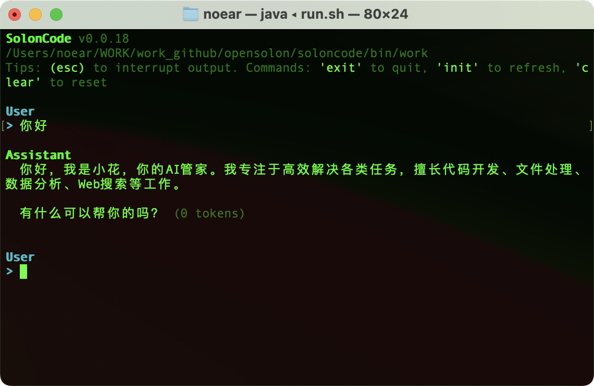

<div align="center">
<h1>SolonCode</h1>
<p>Відкритий кодувальний агент, побудований на <a href="https://github.com/opensolon/solon-ai">Solon AI</a> та Java (підтримує середовища виконання Java8 до Java26)</p>
<p>Остання версія: v2026.4.5</p>

</div>

<div align="center">

[中文](README.zh.md) | [日本語](README.ja.md) | [한국어](README.ko.md) | [Deutsch](README.de.md) | [Français](README.fr.md) | [Español](README.es.md) | [Italiano](README.it.md)

[Русский](README.ru.md) | [العربية](README.ar.md) | [Português (BR)](README.br.md) | [ไทย](README.th.md) | [Tiếng Việt](README.vi.md) | [Polski](README.pl.md)

[বাংলা](README.bn.md) | [Bosanski](README.bs.md) | [Dansk](README.da.md) | [Ελληνικά](README.gr.md) | [Norsk](README.no.md) | [Türkçe](README.tr.md) | [Українська](README.uk.md)

</div>

## Встановлення та налаштування

Встановлення:

```bash
# Mac / Linux:
curl -fsSL https://solon.noear.org/soloncode/setup.sh | bash

# Windows (PowerShell):
irm https://solon.noear.org/soloncode/setup.ps1 | iex
```

Налаштування (обов'язково змінити після встановлення):

* Каталог встановлення: `~/soloncode/bin/`
* Знайдіть файл конфігурації `~/solnocode/bin/config.yml` та змініть налаштування `chatModel` (головним чином)
* Для параметрів налаштування `chatModel` дивіться: [Налаштування моделі та параметри запиту](https://solon.noear.org/article/1087)

## Запуск

Запустіть команду `soloncode` з будь-якого каталогу в консолі (тобто вашої робочої директорії).

```bash
demo@MacBook-Pro ~ % soloncode
SolonCode v2026.4.5
/Users/noear
Tips: (esc) interrupt | '/exit': quit | '/resume': resume | '/clear': reset

User
> 
```

Тестування функцій (спробуйте наступні завдання, від простих до складних):

* `你好`
* `用网络分析下 ai mcp 协议，然后生成个 ppt` // Рекомендується попередньо встановити деякі навички
* `帮我设计一个 agent team（设计案存为 demo-dis.md），开发一个 solon + java17 的经典权限管理系统（demo-web），前端用 vue3，界面要简洁好看`


## Документація

Для отримання більш детальної інформації про налаштування відвідайте нашу [Офіційну документацію](https://solon.noear.org/article/soloncode).

## Участь у розробці

Якщо ви зацікавлені у внесенні коду, будь ласка, ознайомтеся з [Документацією для учасників](https://solon.noear.org/article/623) перед поданням PR.

## Розробка на основі SolonCode

Якщо ви використовуєте "soloncode" у назві вашого проекту (наприклад, "soloncode-dashboard" або "soloncode-app"), будь ласка, вкажіть у README, що проект не розроблений офіційно командою OpenSolon та не має жодного відношення до неї.

## Часті питання

У чому різниця від Claude Code та OpenCode?

Вони функціонально схожі, з ключовими відмінностями:

* Побудований на Java, 100% відкритий код.
* Незалежний від провайдера. Потребує налаштування моделі. Ітерація моделей зменшить розриви та знизить витрати, роблячи підхід незалежності від провайдера важливим.
* Зосереджений на термінальному інтерфейсі командного рядка (CLI), працює через системні команди.
* Підтримує Web, протокол ACP для віддаленого зв'язку.